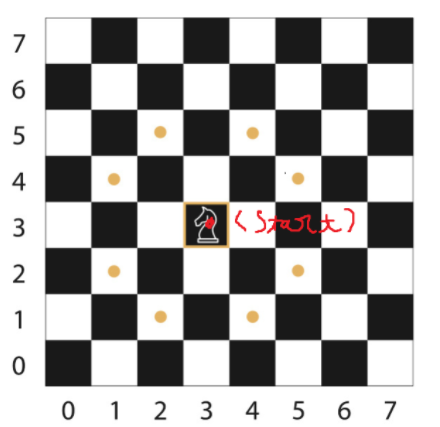
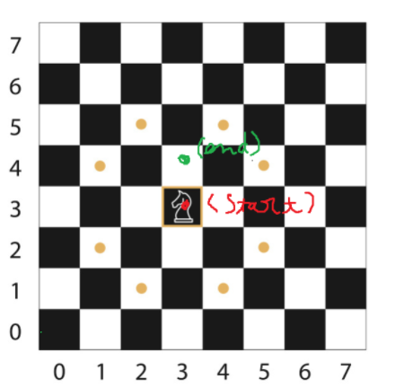
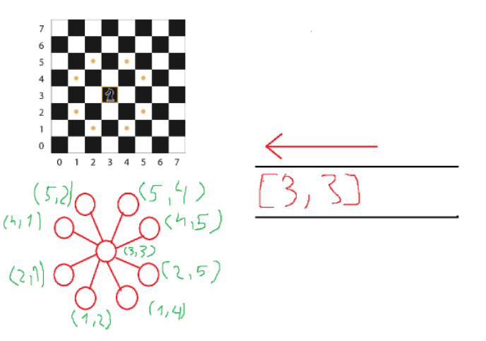
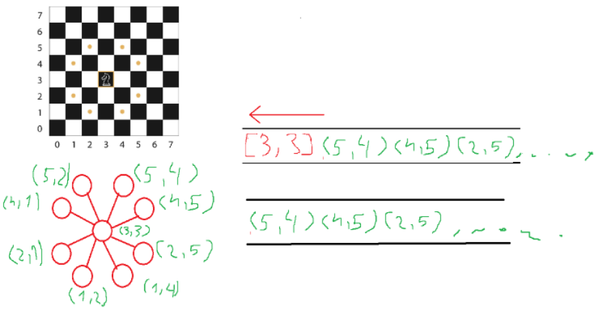
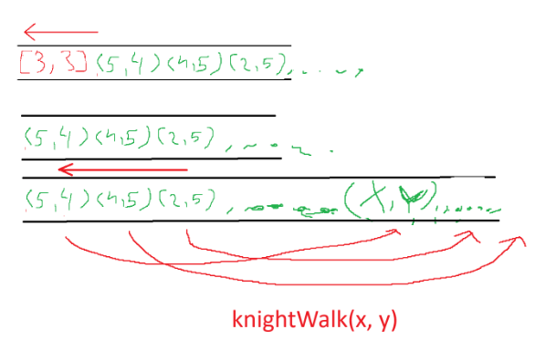

# Knights-Travails-TOP

## Use graphp to find the shortest path for knihgt on chess board

+ The Queue class create a queue to dequeue and enqueue.
+ **knightWalk(position)** return an array of all possible moves of a knight, not including out of chess board.

    

+ **knightMove(start, end)** function will traverse the board with all possible moves and then push them in the queue

    

    * Before loop, enqueue the start position to queue.

    

    * First, enqueue the start point, loop when queue not empty, from there take the dequeue data and go to **knightWalk(*dequeue_value*)** to take all possible path

    

    * Second, after take all step, dequeue the first item from queue and continue BFS steps from **knightWalk(*dequeue_value*)**

    

    * Third, all steps from first queue position continue enqueue to travail later

    

    * Next, each moves from the **knightWalk(*dequeue_value*)** will be check with a Map to check whether it is traverse or not
        -> If not appear on Map, so add them to map with key: [posX, posY] => value: {predecessor: *dequeue_value*, distance: *dequeue_value* + 1}
        -> If appear on Map, ignore them and try with other position

        ### If found the value, the *position* === the *end position* take predecessor and the distance of *position* add them to a recursive function to find all predecessors and save to an object with: 

        <code>getStepPosition(moveStep, start, previousNode)
            + moveStep parameter is the map contains all position
            + start position is the start position
            + previousNode is the predecessor position
            return distance and all predecessor move from the end position
        </code>
